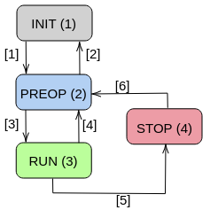

# Introduction

This repository contains the ROS 2 wrappers to run. The node creates all topics and service to integrate the [3D printed robotc actuator](https://github.com/ManuelSanchezMo/Robotic_actuator).  

# DRIVER

  

##Dependencies

* can
* can_tools

##INTEREFACE
###Topics
Input:

* */motor_1/command_angle* (*motor_interfaces/SendComm.msg*). Input angle command. 
* */motor_1/elec_out* (*motor_interfaces/OutElec.msg*).  Output electrical state of motor.
* */motor_1/mec_out* (*motor_interfaces/OutMec.msg*).  Output mechanical state of motor.

Services: 

* */motor_1/motor_config_1* (*motor_interfaces/Config1.srv*). Congi1 service for motor PID params configuration. 
* */motor_1/motor_config_2* (*motor_interfaces/Config2.srv*). Congi2 service for motor PID_vel params configuration. 
*  */motor_1/motor_config_3* (*motor_interfaces/Config3.srv*). Congi3 service for motor  params configuration. 
* /motor_1/send_transition* (*motor_interfaces/SendTransition.srv*). Send transition service for internal Finite State Machine. 